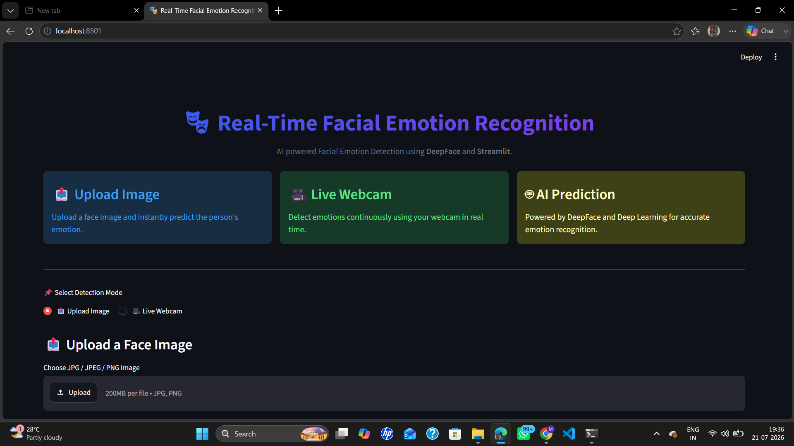
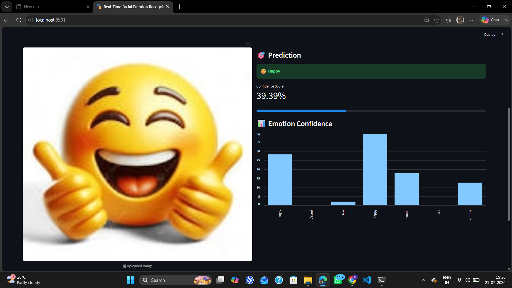

# 🎭 Real-Time Emotion Detection System

A complete, beginner-friendly Python project that detects human faces via webcam
and classifies emotions in real time using a Convolutional Neural Network (CNN).

```
 Webcam → Face Detection → Face ROI → CNN Model → Emotion Label + Confidence
                ↓                                         ↓
         Bounding Box                          Statistics Panel + Alert System
```

---

## ✨ Features

| Feature | Description |
|---|---|
| 🎥 Live webcam feed | Real-time OpenCV capture at up to 30 FPS |
| 👤 Face detection | Haar Cascade (fast) or DNN (accurate) |
| 🧠 CNN model | 3-block architecture, 3.7 M params |
| 😊 7 emotions | Angry · Disgust · Fear · Happy · Neutral · Sad · Surprise |
| 📊 Stats panel | Live emotion frequency histogram |
| 🚨 Alert system | Fires when negative emotion persists > 5 s |
| 📝 CSV logging | Every detection timestamped and saved |
| 📡 IoT ready | Optional ThingSpeak cloud upload |

---

## 📁 Folder Structure

```
emotion_detection/
│
├── emotion_detector.py        ← 🚀 MAIN ENTRY POINT — run this
├── train_model.py             ← Train CNN on FER-2013 from scratch
├── download_pretrained.py     ← Download pre-trained weights automatically
├── requirements.txt           ← Python dependencies
├── README.md                  ← This file
│
├── utils/
│   ├── __init__.py
│   ├── face_detector.py       ← Haar Cascade & DNN face detection
│   ├── emotion_predictor.py   ← CNN model build + inference
│   ├── display_utils.py       ← All OpenCV drawing helpers
│   ├── emotion_logger.py      ← CSV session logger
│   ├── alert_system.py        ← Negative-emotion alert logic
│   └── iot_sender.py          ← Optional ThingSpeak IoT uploader
│
├── models/
│   └── emotion_model.h5       ← Trained weights (created by train/download)
│
├── data/
│   └── fer2013.csv            ← Place FER-2013 dataset here (for training)
│
├── logs/
│   └── training/              ← TensorBoard logs (created during training)
│
└── saved_emotions/
    ├── emotions_<ts>.csv      ← Per-session emotion log (auto-created)
    └── screenshot_<ts>.jpg    ← Screenshots (press S while running)
```

---

## 🚀 Quick Start

### 1 — Clone / download the project

```bash
cd emotion_detection
```

### 2 — Create a virtual environment (recommended)

```bash
python -m venv venv
# Windows:
venv\Scripts\activate
# macOS / Linux:
source venv/bin/activate
```

### 3 — Install dependencies

```bash
pip install -r requirements.txt
```

### 4 — Get a model (choose ONE option)

#### Option A — Download a pre-trained model automatically

```bash
python download_pretrained.py
```

#### Option B — Train from scratch on FER-2013

1. Download `fer2013.csv` from Kaggle:
   → https://www.kaggle.com/datasets/msambare/fer2013
2. Place it at `data/fer2013.csv`
3. Run:
   ```bash
   python train_model.py
   ```
   Training takes ~1–2 hours on CPU, ~15 min on GPU.
   Best weights are automatically saved to `models/emotion_model.h5`.

### 5 — Run the detector!

```bash
python emotion_detector.py
```

A window will open showing your webcam feed with real-time emotion detection.

**Keyboard controls:**
- `Q` — Quit
- `S` — Save screenshot to `saved_emotions/`

---

## ⚙️ Configuration

Edit the top of `emotion_detector.py`:

```python
WEBCAM_INDEX        = 0      # Change if you have multiple cameras
FRAME_WIDTH         = 1280   # Capture resolution
FRAME_HEIGHT        = 720
ALERT_THRESHOLD_SEC = 5      # Seconds before negative-emotion alert fires
```

Switch face detector (edit `emotion_detector.py`):

```python
face_detector = FaceDetector(method="haar")   # fast, works offline
face_detector = FaceDetector(method="dnn")    # more accurate
```

---

## 🧠 CNN Architecture

```
Input: 48×48×1 (grayscale)
│
├── Block 1: Conv2D(32) × 2 → BN → MaxPool → Dropout(0.25)
├── Block 2: Conv2D(64) × 2 → BN → MaxPool → Dropout(0.25)
├── Block 3: Conv2D(128) × 2 → BN → MaxPool → Dropout(0.25)
│
├── Flatten
├── Dense(1024) → BN → Dropout(0.5)
└── Dense(7, softmax)  ← 7 emotion classes

Total parameters: ~3.7 million
Expected FER-2013 accuracy: ~65–68%
```

---

## 📡 IoT Integration (Optional)

Send live emotion data to ThingSpeak:

1. Create a free account at https://thingspeak.com
2. Create a channel with 8 fields (Angry, Disgust, Fear, Happy, Neutral, Sad, Surprise, Dominant)
3. Copy your Write API Key
4. In `emotion_detector.py`, add:

```python
from utils.iot_sender import ThingSpeakSender
sender = ThingSpeakSender(api_key="YOUR_WRITE_API_KEY")
# Inside the loop, after emotion detection:
sender.send(emotion_counts, dominant_emotion)
```

---

## 🔧 Troubleshooting

| Problem | Fix |
|---|---|
| `Cannot open webcam` | Change `WEBCAM_INDEX = 1` (or 2) |
| Low FPS | Switch to `method="haar"` or lower `FRAME_WIDTH` |
| `No module named tensorflow` | Run `pip install tensorflow` |
| Random predictions | Run `train_model.py` or `download_pretrained.py` first |
| Haar cascade not found | Reinstall: `pip install --upgrade opencv-python` |
| DNN download fails | It falls back to Haar automatically |

---

## 📊 Emotion Classes

| Index | Emotion | Emoji | Type |
|---|---|---|---|
| 0 | Angry | 😠 | Negative |
| 1 | Disgust | 🤢 | Negative |
| 2 | Fear | 😨 | Negative |
| 3 | Happy | 😊 | Positive |
| 4 | Neutral | 😐 | Neutral |
| 5 | Sad | 😢 | Negative |
| 6 | Surprise | 😮 | Neutral |

---

## 📜 License

MIT — free to use, modify, and distribute.
=======
😊 Real-Time Facial Emotion Recognition Using Deep Learning
📌 Project Overview

This project is a real-time facial emotion recognition system that detects human emotions using a webcam. It uses computer vision and a Convolutional Neural Network (CNN) model to classify facial expressions such as happy, sad, angry, neutral, and surprise.

The system captures live video, detects faces, and predicts emotions instantly, displaying the results on the screen.

🎯 Features
       Real-time webcam emotion detection
   😀 Detects multiple emotions (happy, sad, angry, neutral, surprise)
   📦 Face detection using OpenCV
   🧠 Emotion classification using CNN / pre-trained model
   📊 Displays emotion label with confidence
   ⚡ Fast and efficient real-time processing
🛠️ Technologies Used
         Python
         OpenCV
         TensorFlow / Keras (or PyTorch)
         NumPy
         Matplotlib (optional)
📂 Project Structure
         emotion-detection/
         │
         ├── model/
         │   └── emotion_model.hdf5
         │
         ├── haarcascade_frontalface_default.xml
         ├── emotion_detection.py
         ├── requirements.txt
         └── README.md
📥 Installation
         1️⃣ Clone the Repository
         git clone https://github.com/your-username/emotion-detection.git
         cd emotion-detection
         2️⃣ Install Dependencies
         pip install -r requirements.txt

  Or manually:

         pip install opencv-python tensorflow numpy matplotlib
        ▶️ How to Run
        python emotion_detection.py
        Webcam will open
        Face will be detected
        Emotion will be displayed in real time
        
🧠 Model Details
          Model: Convolutional Neural Network (CNN)
          Dataset: FER2013 (or pre-trained model)
         Input size: 48x48 grayscale images
Output classes:
          Happy
          Sad
          Angry
          Neutral
         Surprise
📊 Output Example
         Face detected with bounding box
         Emotion label displayed (e.g., Happy 😊)
         Confidence score (optional)
🚀 Future Improvements
        📱 Mobile app integration
        ☁️ Cloud storage (Firebase / ThingSpeak)
        📈 Emotion analytics dashboard
        🎭 More emotion categories
        🔔 Alert system for negative emotions
🎯 Applications
        Mental health monitoring
        Smart surveillance systems
        Customer feedback analysis
        Human-computer interaction

#output

    

      

       

👩‍💻 Author

      Madhumidha A
>>>>>>> origin/main
